# Deploying BERT in Edge Devices: Compression by Heads Pruning & Layer Drop

> Final Project of Columbia COMS 6998 Practical Deep Learning System Performance, 2022 Spring. <br> By Zihan Wang (UNI: zw2782) and Jace Yang (UNI: jy3174)

## 1. Project Introduction

In this research, we explore a variety of heads and layers pruning strategies on BERT in order to find a feasible latency-accuracy trade-off while depolying BERT to edge devices.

In Section 1, we will provide a brief overview of the intuition and background work of pruning.

### 1.1 Pruning attention heads in transformer models

In paper [Are Sixteen Heads Really Better than One?](https://arxiv.org/abs/1905.10650) researchers came to a surprising conclusion: most attention heads can be individually removed after training without any significant downside in terms of test performance. 

However, while attempting to answer the question "Are important heads 'universally' important across datasets?" in the chapter 3.4, researchers only employed two out-of-domain test sets, that are, from our perspective, not totally unrelated! 

Therefore, we believe that the conclusion that key heads are universally important across the dataset needs further experiment. Specifically, we perform ablation study by masking attention heads (replace attention output with zero-vector) in each layer during the testing stage using GLUE dataset, and then conduct a comprehensive analysis across different tasks to see how pruning affects testing accuracy.


For layer and heads pruning experiments, we perform task-specific fine-tuning using the [GLUE](https://gluebenchmark.com/leaderboard) training set and evaluate testing metrics on the official dev set. Among a variety of language understanding tasks in GLUE, we report model performance on 6 tasks, i.e. **SST-2**(Sentiment Analysis), **CoLA**(Corpus of Linguistic Acceptability); **WNLI**(Winograd NLI), **STS-B**(Semantic Textual Similarity Benchmark), **RTE**(Recognizing Textual Entailment) and **MRPC**(Microsoft Research Paraphrase Corpus).

### 1.2 Pruning layers in transformer models

There is an embedding layer and L encoder layers for pretrained language models such as BERT, XLNet, Roberta, and others image src="https://render.githubusercontent.com/render/math?math=l 1, l 2, dots, l, l L">. However, different layers in transformer-based models capture distinct linguistic information, according to the research [Linguistic Knowledge and Transferability of Contextual Representations](https://arxiv.org/abs/1903.08855). Lower layers of the network, for example, capture syntax information, but middle and higher levels of the network learn higher-level information.

These findings, coupled with the CMU paper cited in Section 1.1, encourage us to study the effect of dropping each layer on the testing performance. We experimented with various layer-dropping procedures, including top-layer dropping, bottom-layer dropping, and symmetric dropping.

### 1.3 Deployment on End-Device

[Huggingface](https://huggingface.co/)'s [DistilBERT](https://huggingface.co/transformers/model_doc/distilbert.html) provides a smaller and faster version of BERT. It has the same structure as our 6-layers dropped BERT, therefore it can be used as a method to verify our idea. In this project, we quantized and deployed DistilBERT on Google Pixel 2 (Android 11.0 x86, 4GB RAM, 64GB Storage) to perform Question Answering, Sentiment Analysis(SST-2), Semantic Textual Similarity Analysis (STS-B) tasks within both space and inference time constraints.


## 2. Repository Architecture Description

The Repository has three main directories: `pytorch-pretrained-BERT`, `AndroidApp`, and `logs`. 


### 2.1 **pytorch-pretrained-BERT**

This repository contains an PyTorch reimplementation of [Google's TensorFlow repository for the BERT model](https://github.com/google-research/bert) that was released together with the paper [BERT: Pre-training of Deep Bidirectional Transformers for Language Understanding](https://arxiv.org/abs/1810.04805) by Jacob Devlin, Ming-Wei Chang, Kenton Lee and Kristina Toutanova. Our code is based on this repository: https://github.com/maknotavailable/pytorch-pretrained-BERT.

In order to perform heads pruning experiments, we reconstructed the BERT in  `pytorch-pretrained-BERT/pytorch_pretrained_bert/modeling.py`by adding functions related to heads_pruning (such as prune_heads, mask_heads) in `BertAttention` module.  Typically, we finetune the entire Bert model on the GLUE dataset, then prune each head (there are 12*12 = 144 heads in total) and test on the GLUE test sets.

To run layer pruning experiments, we introduce the argument `remove_layers` which takes a layer index as an argument and deletes the parameters for the associated layers in pre-trained BERT. We employ many layer dropping tactics, including top-layer dropping, bottom-layer dropping, symmetric middle-layer dropping. Bert is then pruned and used for fine-tuning and inferencing.

In order to fine-tune the model and test it on GLUE benchmark, we also developed codes for GLUE dataset preprocessing, as well as pipeline for running classification tasks of GLUE in `pytorch-pretrained-BERT/examples/run_classifier.py` , and module for running regression tasks of GLUE in `pytorch-pretrained-BERT/examples/run_regression.py`.

### 2.2 AndroidApp

This directory is the deployment of compressed Bert model on Android edge device. `Kotlin` is used to develope this module.

We firstly quantize and convert the Huggingface's DistilBert QA model to TorchScript and deploy it on Android perform question answering. Then we use DistilBert finetuned on GLUE dataset and deploy it on Android to perform tasks such as Sentiment Analysis(SST-2) and Semantic Textual Similarity Analysis (STS-B).

### 2.3 Result analysis

`logs` is the output directory of *2.1*, which records our experiment results as well as codes to transform the log text, format data, and plot the graphs that our analysis rely on in *Part 4*.

## 3. Commands to Execute Our Code

### 3.1 Prerequisite 

#### 3.1.2 Install packages
use the following command to install packages:
```sh
pip install pytorch_pretrained_bert
pip install transformers
```

The torch version is 1.10.0+cu111, and python version is 3.8. 

#### 3.2.2 Download Preprocessed GLUE Dataset 
We already preprocessed the GLUE Dataset with task `CoLA, RTE, STS-B, MRPC, SST-2, WNLI`, please download the dataset from: https://drive.google.com/drive/folders/1--7Tp6I7mWJsnONgc4Gv7ZYhRNy4fbse?usp=sharing, and place the unziped file in directory path `Bert_compression/GLUE_data`.

### 3.2 Run Experiment

For attention heads pruning, since there are 12 layers and 12 heads for each layer, we need to perform 144 pruning experiments for testing stage for each of the 6 tasks. For layer drop, we experiment pruning 2, 4, or 6 layers with 3 different strategies, so that will be 9 experiments for each of the 6 tasks.


#### 3.2.1 Head pruning experiment
- For classification tasks (CoLA, SST-2, MRPC), please run the following command in directory `Bert_compression/pytorch-pretrained-BERT/`:

  ```sh
  ##cola,mrpc,sst-2
  python examples/run_classifier.py \
      --task_name MRPC \
      --do_train \
      --do_eval \
      --do_lower_case \
      --data_dir /path/to/GLUE_data/MRPC/ \
      --bert_model bert-base-uncased \
      --max_seq_length 128 \
      --train_batch_size 32 \
      --eval_batch_size 32 \
      --learning_rate 2e-5 \
      --num_train_epochs 3.0 \
      --output_dir  /path/to/models/MRPC/full 2>&1
  ```

- For regression tasks (RTE, STS-B, WNLI), please run the following command in directory `Bert_compression/pytorch-pretrained-BERT/`:
  ```sh
  python examples/run_regression.py \
    --model_type bert \
    --model_name_or_path bert-base-cased \
    --task_name wnli \
    --do_train \
    --do_eval \
    --do_lower_case \
    --data_dir /path/to/GLUE_data/WNLI \
    --max_seq_length 128 \
    --per_gpu_train_batch_size 32 \
    --learning_rate 2e-5 \
    --num_train_epochs 1.0 \
    --output_dir/path/to/models/WNLI \
    --overwrite_output_dir \
  ```

This way, we performed ablation study on each of the 12 × 12 attention heads iteratively, and show the test results on GLUE benchmark after removing each head. 

#### 3.2.2 Layer Pruning Experiment

- Classification tasks:

  ```
  python examples/run_classifier.py \
      --task_name MRPC \
      --do_train \
      --do_eval \
      --do_lower_case \
      --data_dir /path/to/GLUE_data/MRPC/ \
      --bert_model bert-base-uncased \
      --max_seq_length 128 \
      --train_batch_size 32 \
      --eval_batch_size 32 \
      --learning_rate 2e-5 \
      --num_train_epochs 3.0 \
      --remove_layers "0,1,2,3" \
      --output_dir  /path/to/models/MRPC/full 2>&1
  ```


- Regression tasks:

  ```shell
  python examples/run_regression.py \
    --model_type bert \
    --model_name_or_path bert-base-cased \
    --task_name wnli \
    --do_train \
    --do_eval \
    --do_lower_case \
    --data_dir /path/to/GLUE_data/WNLI \
    --max_seq_length 128 \
    --per_gpu_train_batch_size 32 \
    --learning_rate 2e-5 \
    --num_train_epochs 1.0 \
    --output_dir/path/to/models/WNLI \
    --remove_layers "0,1,2,3" \
    --overwrite_output_dir \
  ```


#### 3.2.3 Deployment on Edge Device

**(1) Question Answering Task**

Firstly, run `python convert_distilbert_qa.py` to generate quantized DistilBert model for QuestionAnswering.  After the script completes, copy the model file `qa360_quantized.ptl` to the Android app's assets folder.

<center></center>

**(2) Semantic Textual Similarity Analysis**

Run `python convert_distilbert_sts.py` to generate quantized DistilBert model for Semantic Textual Similarity Analysis. 

<center>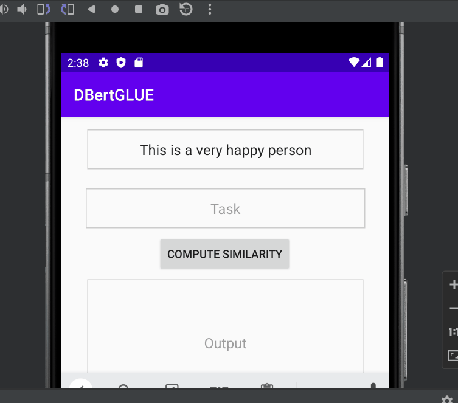</center>

**(3) Sentiment Classification Task**

Similarity, run `python convert_distilbert_sst.py` to generate quantized DistilBert model for sentiment analysis. 

<center>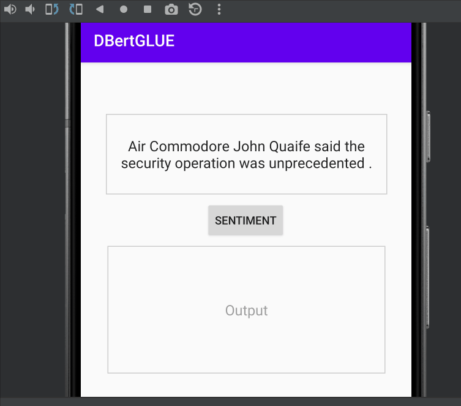</center>


## 4. Results & Observations

For each of 6 GLUE tasks, we run 144 different heads pruning and 9 different Layer Dropping experiments, then evaluate performance base on their [GLUE metric](https://gluebenchmark.com/tasks). The experiment design flow to obtain the result in this section is as below:

<center>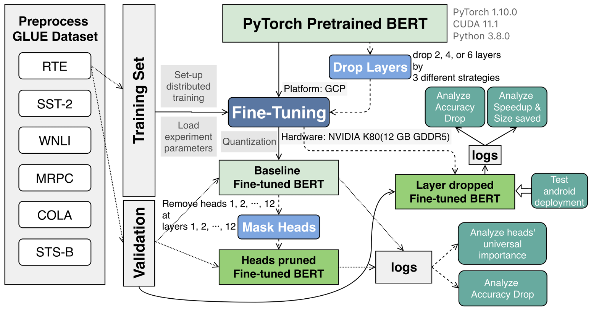</center>

In Part 4, we will analyze the result and share our observations.

### 4.1 Effect of Heads Pruning

In part 4.1, we complete our experiments result with the paper [Are Sixteen Heads Really Better than One?](https://arxiv.org/abs/1905.10650) for which we reproduced their methods.


#### 4.1.1 Effect of Ablating One Head

The original publication simply shows the results of the WMT model of 1 task (in Table 1) and concludes that: at test time, most heads are redundant given the rest of the model. We'll conduct more thorough experiments to check if the statement is correct.

- Performance after removing task is task-dependent:

  <center>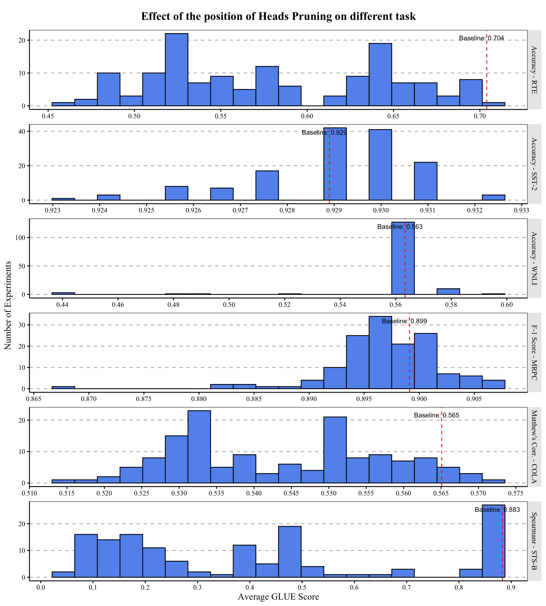</center>

   - We note that the effect of pruning attention heads varies depending on the task. The accuracy of the complete model without pruning is represented by the red dot line in this plot. We discovered that nearly half of the pruning attention heads results in a *higher* accuracy score for tasks like SST-2 and MRPC! This means that most heads are redundant during their testing. 
   
   - However, for tasks such as RTE and STS-B, trimming most of the heads is detrimental to accuracy. What is the cause of this occurrence? We'll talk about it later.


- Break down the performance drop into details:
  <details open>
  <summary>
  📈 <strong>MRPC</strong>
  </summary>
  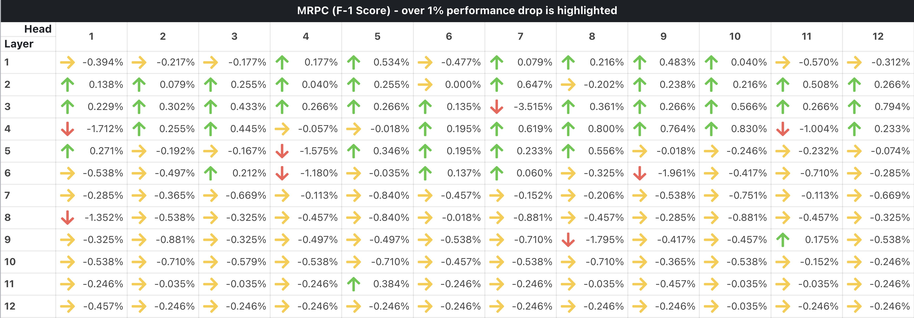
  </details>

  <br>

  <details open>
  <summary>
  📈 <strong>SST-2</strong>
  </summary>
  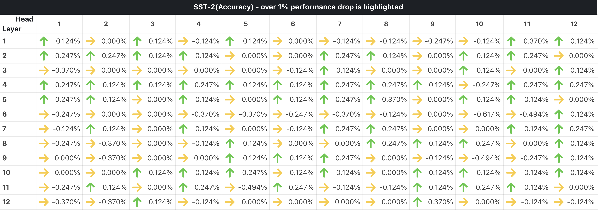
  </details>

  <br>

  <details open>
  <summary>
  📉 <strong>WNLI</strong>
  </summary>
  
  </details>

  <br>

  <details open>
  <summary>
  📉 <strong>COLA</strong>
  </summary>
  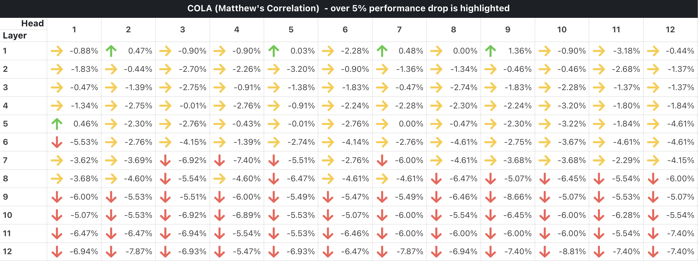
  </details>

  <br>

  <details open>
  <summary>
  📉 <strong>STS-B</strong>
  </summary>
  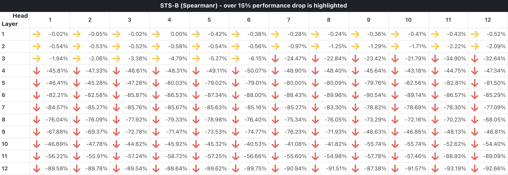
  </details>

  <br>

  <details open>
  <summary>
  📉 <strong>RTE</strong>
  </summary>
  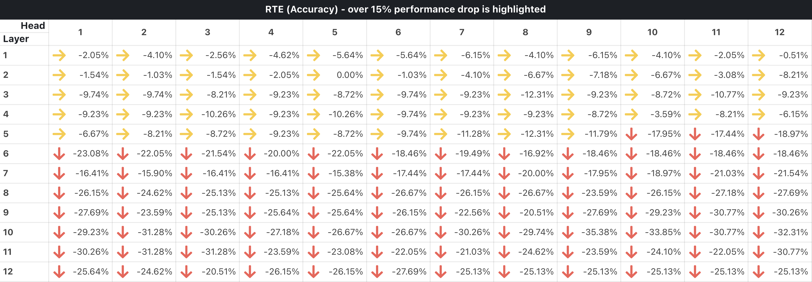
  </details>

  **Conclusion from above tables: The performance head-pruning is related to the difficulty of tasks.** 

  - First, let's consider the question, "What makes pruning possible?" We believe that is due to the **redundancy in parameters**. We don't require all heads to perform equally well on our downstream tasks, especially for those tasks that are relatively "simple." 

    - For example, in the SST-2 task, pruning all result in a *higher* or nearly same accuracy score. Why is this the case? We believe this is due to the fact that SST-2 job is simply a sentiment binary classification problem, and we don't even need self-attention to extract **context** information to perform well on this task. After all, prior to the widespread use of deep learning neural networks, binary sentiment categorization was performed using **bag-of-words** and basic logistic regression! We know that bag-of-words fully disregards word order, meaning that binary emotion classification tasks can perform well even in the absence of word order.

  - On the other hand, *let's think about what makes BERT powerful*. BERT firstly uses WordPiece embeddings as input, and this embedding is meant to learn *context-independent* representations, whereas the transformer layer with self-attention are meant to learn *context-dependent* representations. 

    However, the power of BERT-like representations comes mostly from the use of context-dependent representations. Without these context-dependent representations enabled by self-attention mechanism, BERT is nothing more than traditional Word2vec.

  - Let's think about the sentiment binary classification task again.  We can already perform well with context-independent representations because we can perform well with bag-of-words representations. As a result, most attention heads that capture context-dependent information are redundant to some extent. This is probably why we can prune most of the attention heads without observing a significant drop in accuracy.

  - However, for the RTE (The Recognizing Textual Entailment datasets) task, pruning the majority of the attention heads produces the worst results. To understand why this is happening, we must first understand what an RTE task is. RTE is a classification task that determines whether two sentences' relationships are *neutral, contradiction, or entailment*. This is a difficult logical problem, even for humans, and the order of words appears to be crucial ("A entails B" is not equal to "B entails A"). As a result, we must rely on BERT to capture context information via the self-attention mechanism, and all attention heads are indispensable in this task.


#### 4.1.2 Are heads universally important?

The researchers conclude in the NIPS paper that the important heads are "universally" important (By Figure 2), but they do so only by using two claimed "out-of-domain" test sets: for the original Transformer model, they use newstest2013(English-German data) and MTNT(English-French data); for BERT, they use MNLI mismatched validation set and MNLI matched set. From our perspective, these two "out-of-domain" test sets are not completely unrelated.

Therefore, we perform more experiments on six intrinsically different tasks, and  we can assess the correlation for each task pair in this scatter plot:

<center>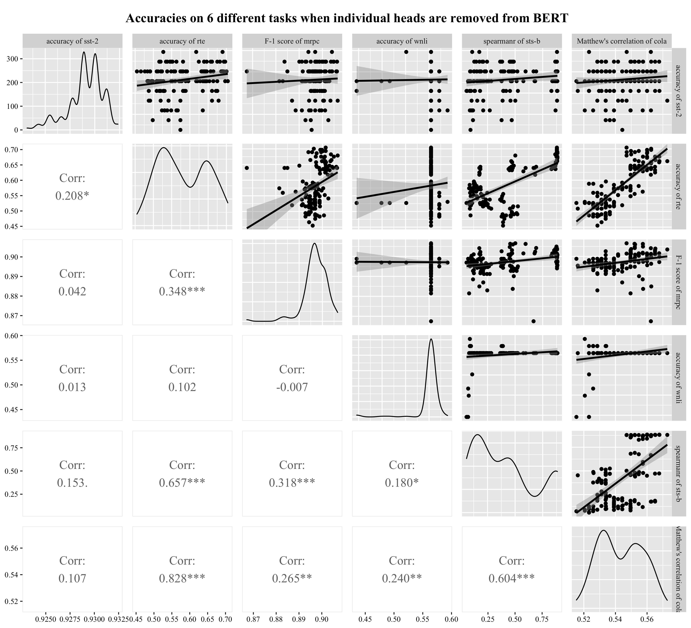</center>

- Although some task pairs have high correlation scores, many task pairs have correlation scores close to zero, and some correlation scores are even negative, implying that deleting the same attention heads may have opposite effects on two different tasks.

- As a result, our extensive experiment disproves the conclusion in that NIPS paper: we discovered that the importance of heads is task-dependent rather than "universal."


### 4.2 Layer drop

Our research is based on similar observations of head pruning. On the one hand, we recognize the need to fine-tune the model again after simplifying its structure. However, because our goal is to deploy BERT in edge devices, we further question whether it is necessary to use all layers of a pre-trained model in downstream tasks!

Let's look at the result of layer pruning:

- Top drop is generally better, but sometimes symmetric drop also works:

  <center>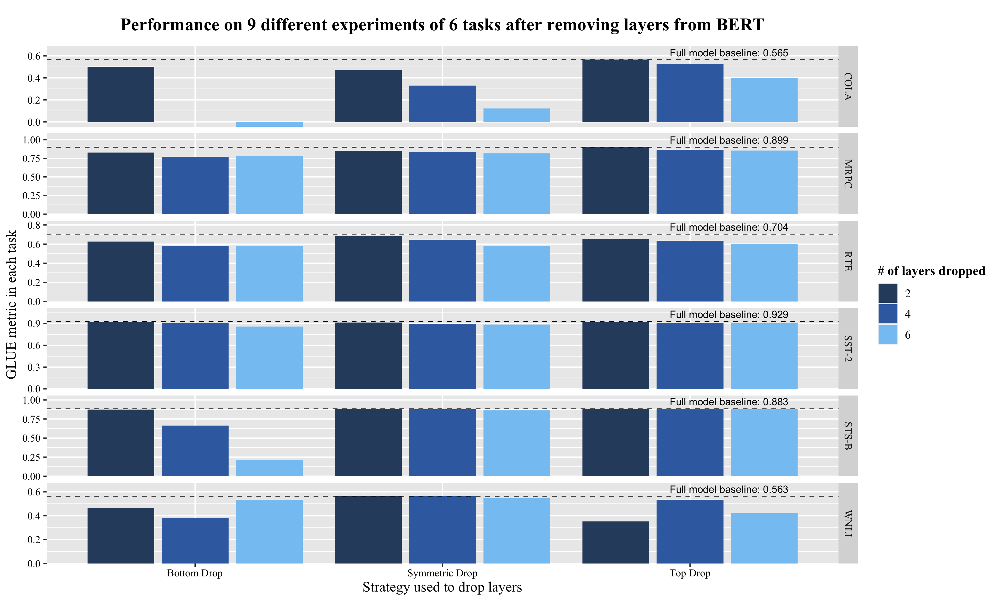</center>
  
  - Top layer and symmetric layer pruning result in a smaller performance drop, whereas bottom layer pruning results in a large performance drop. 

  - This is most likely because the bottom layer captures the low-level word representation required by the upper layers. 
  
  - Therefore, we can use a simple strategy to balance the latency-accuracy tradeoff: if the strategy results in a tolerable performance drop, we choose the one with the most layers dropped.


- And two of the tasks, RTE and WNLI show significant time cost . 

  <center>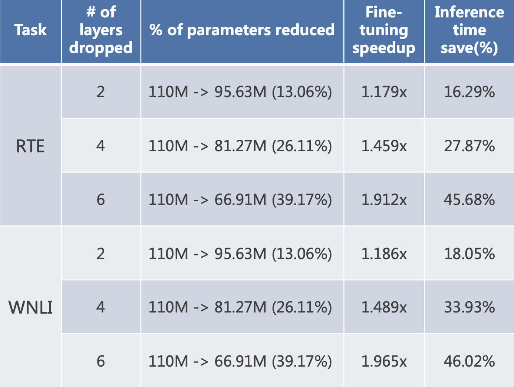</center>

  - Layers Drop significantly reduces fine-tuning and inference time, as well as parameter size.
  
  - Furthermore, by successfully deploying the 6-layers DistilBert, which has the same structure as the 6-layers dropped BERT, we can demonstrate that the layer dropping concept is deployable. In addition, unlike DistilBERT, we apply layer drop to pretrained BERT in our method, so we only need finetuning time.


### 4.3 Observations / Conclusions

The idea behind pruning is that deep neural models are overparameterized and that not all of them are strictly required, particularly during inference. From this project, we conclude that:

1. The performance of head-pruning is related to the difficulty of tasks.

    - Heads fine-tuned in a simple task like sentiment classification will converge to similar weights. Therefore we can safely remove some of them without negatively impacting performance.

    - In difficult task that requires contextual understanding, every head can be indispensable. 

    - The result of the NIPS paper is flawed – attention heads are not universally important across tasks. The lesson here is that a strong argument requires extensive testing!

2. Layer drop is an effective approach when resources are limited. Even without pra-training from corpus, it can achieve a 46% reduction in inference time and a 40% reduction in parameter size while retaining 90%+ of the original score.
